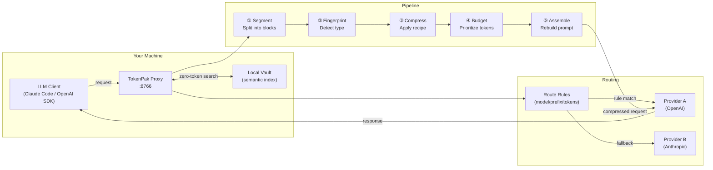

# TokenPak

> **Zero-token operations. Maximum context efficiency.**

TokenPak is an open-source LLM proxy agent that compresses context, routes requests intelligently, and tracks costs — all without touching your prompts or credentials.

[](https://github.com/kaywhy331/tokenpak/actions)
[](https://pypi.org/project/tokenpak/)
[](https://pypi.org/project/tokenpak/)
[](https://python.org)
[](LICENSE)

---

## 3 Commands to Savings

```bash
pip install tokenpak          # install
tokenpak serve --port 8766    # start proxy
tokenpak cost --week          # watch savings grow
```

Point your LLM client's base URL at `http://localhost:8766`. That's it — **zero config required.**

---

## What It Does

- **Compresses context** before it hits the API — fewer tokens, lower cost
- **Routes requests** to the right model (fast/cheap vs. powerful/expensive)
- **Tracks costs** locally — per model, per session, per agent
- **Indexes your vault** for instant semantic search without an LLM call
- **80%+ of operations cost zero tokens** — CLI-first, deterministic

## Core Principles

| Principle | What it means |
|-----------|---------------|
| **Zero Data** | We never see your prompts, code, or responses |
| **Zero Credentials** | Pure passthrough proxy — no API keys stored |
| **Zero Lock-in** | Downgrade anytime; keep all your data |
| **Zero Tokens for Ops** | Status, search, cost reports — all free |

---

## Architecture



**Key insight:** The compression pipeline runs locally, before the request leaves your machine. The LLM never sees your raw tokens — only the compressed version.

---

## Plans

| Feature | OSS | Pro | Team |
|---|:---:|:---:|:---:|
| Context compression | ✅ | ✅ | ✅ |
| Model routing | ✅ | ✅ | ✅ |
| Cost tracking | ✅ | ✅ | ✅ |
| Vault indexing + search | ✅ | ✅ | ✅ |
| CLI + proxy | ✅ | ✅ | ✅ |
| A/B testing | ✅ | ✅ | ✅ |
| Replay + debug | ✅ | ✅ | ✅ |
| Advanced compression recipes | — | ✅ | ✅ |
| Budget enforcement + alerts | — | ✅ | ✅ |
| Priority support | — | ✅ | ✅ |
| Multi-agent coordination | — | — | ✅ |
| Shared vault (team) | — | — | ✅ |
| RBAC + audit logs | — | — | ✅ |
| Seat management | — | — | ✅ |
| SSO / enterprise auth | — | — | 🔜 |
| **Price** | **Free** | **$19/mo** | **$49/mo** |

[→ Get a Pro or Team key](https://portal.tokenpak.dev)

---

## Token Savings (QMD + TokenPak)

| Configuration | Avg tokens/req | Reduction |
|---|---:|---:|
| Baseline (no optimization) | 20,801 | — |
| QMD only | 6,136 | 70% |
| QMD + TokenPak | 3,265 | **84%** |

Consistent **~43% additional savings** on top of QMD across writing, coding, legal, and ops tasks.

---

## Performance

| Optimization | Improvement |
|---|---|
| LRU token cache | **25x** faster repeated counting |
| Batch SQLite transactions | **60%** faster indexing |
| Pre-compiled regex | **30%** faster processing |
| Connection pooling + WAL | Reduced I/O overhead |

**Benchmark (572-file vault):**
```
Indexing throughput:  2,738 files/sec
Indexing speedup:     55x faster than baseline
Search latency:       22.7ms/query
```

---

## How Compression Works

TokenPak intercepts requests before they reach the LLM and applies a multi-stage pipeline:

1. **Segmentize** — split content into semantic blocks
2. **Fingerprint** — identify block type (code, docs, config…)
3. **Apply recipe** — use declarative rules to compress that block type
4. **Budget** — allocate tokens using a quadratic priority algorithm
5. **Assemble** — reconstruct the compressed prompt

Result: same semantic content, 20–60% fewer tokens.

---

## CLI Reference

### Core

```bash
tokenpak serve --port 8766     # start proxy
tokenpak status [--full]       # proxy health
tokenpak cost [--week|--month] # cost report
tokenpak savings [--lifetime]  # token savings summary
```

### Compression & Debug

```bash
tokenpak compress <file>       # dry-run compression
tokenpak demo [--verbose]      # see pipeline on real data
tokenpak trace [--id <id>]     # trace a pipeline run
tokenpak debug on              # capture raw/compressed pairs
```

### Vault & Indexing

```bash
tokenpak index [<path>]        # index a directory
tokenpak vault search "query"  # semantic search (zero tokens)
tokenpak calibrate ~/vault     # auto-tune workers for this host
```

### Model Routing

```bash
tokenpak route add --model 'gpt-4*' --target anthropic/claude-3-haiku-20240307
tokenpak route list
tokenpak route test "write unit tests"
```

### Templates & Replay

```bash
tokenpak template list
tokenpak template use my-tpl
tokenpak replay list
tokenpak replay <id> --diff
```

---

## Directory Structure

```
tokenpak/
├── tokenpak/
│   ├── agent/
│   │   ├── compression/    # pipeline, segmentizer, recipes, directives
│   │   ├── proxy/          # request routing + streaming
│   │   ├── routing/        # manual route rules
│   │   ├── telemetry/      # cost tracking, storage
│   │   ├── vault/          # indexer, ast_parser, symbols
│   │   ├── license/        # key generation, validation, store
│   │   └── team/           # multi-agent coordination, shared vault
│   ├── engines/
│   │   ├── heuristic.py    # Rule-based compaction
│   │   └── llmlingua.py    # ML-powered compaction (optional)
│   └── processors/
│       ├── code.py         # Python/JS structure extraction
│       ├── text.py         # Markdown/HTML compression
│       └── data.py         # JSON/YAML/CSV handling
├── portal/                 # self-service web portal
├── recipes/oss/            # built-in compression recipes (YAML)
├── tests/
└── pyproject.toml
```

---

## Configuration

Default config: `~/.tokenpak/config.json`

```json
{
  "proxy": {
    "port": 8766,
    "passthrough_url": "https://api.openai.com"
  },
  "compression": {
    "enabled": true,
    "level": "balanced"
  },
  "budget": {
    "monthly_usd": null,
    "alert_at_pct": 80
  },
  "vault": {
    "db_path": ".tokenpak/registry.db",
    "watch": false
  }
}
```

---

## Requirements

- Python 3.10+
- No external dependencies for core functionality
- Optional: `tiktoken` for accurate token counting
- Optional: `llmlingua` for ML-powered compression

---

## Contributing

We welcome issues and pull requests!

### Quick setup

```bash
git clone https://github.com/kaywhy331/tokenpak
cd tokenpak
pip install -e ".[dev]"
pytest tests/ -q
```

### Dual-remote push (required for CI)

TokenPak uses two remotes: `origin` (GitHub) and `shared` (internal QA). Always push with the verified script:

```bash
bash scripts/push-verified.sh
```

This pushes to both remotes and SSH-verifies the commit hash landed. **Never use bare `git push origin`** — the QA remote will be skipped.

### Guidelines

- All new features need tests (`tests/test_<module>.py`)
- Keep CLI commands backward-compatible
- Compression recipes live in `recipes/oss/` as YAML
- Run `pytest tests/ -q` before opening a PR
- See [ARCHITECTURE.md](ARCHITECTURE.md) for system design

---

## License

MIT — see [LICENSE](LICENSE)
