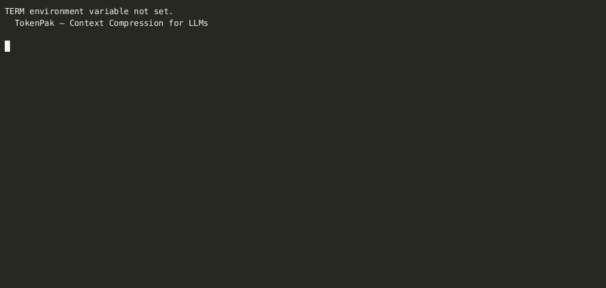
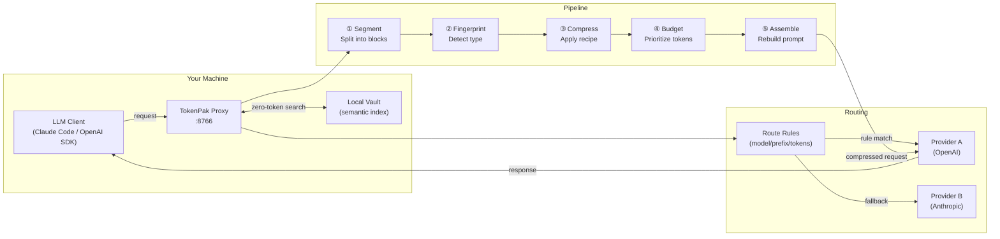

# TokenPak


> **Zero-token operations. Maximum context efficiency.**

TokenPak is an open-source LLM proxy agent that compresses context, routes requests intelligently, and tracks costs — all without touching your prompts or credentials.

**Protocol spec (v1.0):**
- 📜 Spec: [`docs/PROTOCOL.md`](docs/PROTOCOL.md)
- ✅ Schema: [`schemas/tokenpak-v1.0.json`](schemas/tokenpak-v1.0.json)
- 🧪 Validator: [`tokenpak/validator.py`](tokenpak/validator.py)
- 🧩 Examples: [`examples/`](examples/)

[](https://github.com/kaywhy331/tokenpak/actions)
[](https://pypi.org/project/tokenpak/)
[](https://pypi.org/project/tokenpak/)
[](https://pepy.tech/project/tokenpak)
[](LICENSE)
[](https://codecov.io/gh/kaywhy331/tokenpak)

---

## 5-Minute Quickstart (Docker)

Get from zero to seeing savings in 5 minutes — no Python install needed.

**Step 1:** Clone the repo
```bash
git clone https://github.com/kaywhy331/tokenpak.git && cd tokenpak
```

**Step 2:** Create your config
```bash
cp .env.example .env
```

**Step 3:** Add your API key (edit `.env`)
```
ANTHROPIC_API_KEY=sk-ant-...   # Anthropic Claude
# or
OPENAI_API_KEY=sk-...          # OpenAI
```

**Step 4:** Start the proxy
```bash
docker compose up -d
```

**Step 5:** Run the quickstart test
```bash
bash scripts/quickstart-test.sh
```

**Step 6:** See your savings in the dashboard
```
http://localhost:8766/dashboard
```

> That's it. Point your LLM client's `base_url` at `http://localhost:8766` and start saving.

---

## 3 Commands to Savings (pip)

```bash
pip install tokenpak          # install
tokenpak serve --port 8766 --workers 4   # start proxy (4 CPU cores)
tokenpak cost --week          # watch savings grow
```

Point your LLM client's base URL at `http://localhost:8766`. That's it — **zero config required.**

---

## See It In Action



> **48.9% token reduction** — across real payloads, zero config. 5,074 → 2,594 tokens in <1ms.

---

## What It Does

- **Compresses context** before it hits the API — fewer tokens, lower cost
- **Routes requests** to the right model (fast/cheap vs. powerful/expensive)
- **Tracks costs** locally — per model, per session, per agent
- **Indexes your vault** for instant semantic search without an LLM call
- **80%+ of operations cost zero tokens** — CLI-first, deterministic

## Core Principles

| Principle | What it means |
|-----------|---------------|
| **Zero Data** | We never see your prompts, code, or responses |
| **Zero Credentials** | Pure passthrough proxy — no API keys stored |
| **Zero Lock-in** | Downgrade anytime; keep all your data |
| **Zero Tokens for Ops** | Status, search, cost reports — all free |

---

## Architecture



**Key insight:** The compression pipeline runs locally, before the request leaves your machine. The LLM never sees your raw tokens — only the compressed version.

---

## Plans

| Feature | OSS | Pro | Team |
|---|:---:|:---:|:---:|
| Context compression | ✅ | ✅ | ✅ |
| Model routing | ✅ | ✅ | ✅ |
| Cost tracking | ✅ | ✅ | ✅ |
| Vault indexing + search | ✅ | ✅ | ✅ |
| CLI + proxy | ✅ | ✅ | ✅ |
| A/B testing | ✅ | ✅ | ✅ |
| Replay + debug | ✅ | ✅ | ✅ |
| Advanced compression recipes | — | ✅ | ✅ |
| Budget enforcement + alerts | — | ✅ | ✅ |
| Priority support | — | ✅ | ✅ |
| Multi-agent coordination | — | — | ✅ |
| Shared vault (team) | — | — | ✅ |
| RBAC + audit logs | — | — | ✅ |
| Seat management | — | — | ✅ |
| SSO / enterprise auth | — | — | ✅ |
| On-premises deployment | — | — | ✅ |
| **Price** | **Free** | **$99/mo** | **$299/mo** |

**Enterprise:** Custom pricing for large organizations. [Contact sales](mailto:sales@tokenpak.ai).

[→ View full pricing](docs/PRODUCT_STRATEGY.md#product-tiers) | [→ License details](LICENSE_COMMERCIAL.md)

---

## Token Savings (QMD + TokenPak)

| Configuration | Avg tokens/req | Reduction |
|---|---:|---:|
| Baseline (no optimization) | 20,801 | — |
| QMD only | 6,136 | 70% |
| QMD + TokenPak | 3,265 | **84%** |

Consistent **~43% additional savings** on top of QMD across writing, coding, legal, and ops tasks.

---

## Performance

TokenPak is engineered for speed. Compilation must feel free — if it adds perceptible latency, developers won't adopt it.

### Compile Latency Targets

| Pack Size | Blocks | Tokens | p50 target | p95 hard limit |
|-----------|--------|--------|------------|----------------|
| **Small** | 2–3 | ~500 | < 20ms | < 30ms |
| **Medium** | ~10 | ~5,000 | < 30ms | < 50ms |
| **Large** | ~50 | ~50,000 | < 50ms | < 100ms |

Latency gates are **enforced in CI on every PR** — p95 breaches block merge.

### Run Benchmarks

```bash
# Full benchmark suite with pytest-benchmark
pytest tests/benchmarks/ -v --benchmark-json=benchmark.json

# Check thresholds (CI gate)
python scripts/check_benchmark_thresholds.py benchmark.json

# View latency summary
pytest tests/benchmarks/test_compile_performance.py::TestCompilePerformancePlain::test_all_three_packs_summary -s
```

### Internal Optimizations

| Optimization | Improvement |
|---|---|
| LRU token cache | **25x** faster repeated counting |
| Batch SQLite transactions | **60%** faster indexing |
| Pre-compiled regex | **30%** faster processing |
| Connection pooling + WAL | Reduced I/O overhead |

**Benchmark (572-file vault):**
```
Indexing throughput:  2,738 files/sec
Indexing speedup:     55x faster than baseline
Search latency:       22.7ms/query
```

---

## Adoption Ladder — Use One Feature First

TokenPak is designed for incremental adoption. You don't need to adopt the full system.
Start with one feature and grow from there.

| Level | What you get | Import |
|-------|-------------|--------|
| **1 — Token counting** | Count tokens in any string | `from tokenpak import count_tokens` |
| **2 — Simple packing** | Pack a prompt in one call | `from tokenpak import pack_prompt` |
| **3 — Block-based context** | Priority + quality control | `from tokenpak import ContextPack, PackBlock` |
| **4 — Full protocol** | Compile reports + all output formats | `compiled.to_messages()` / `compiled.to_anthropic()` |
| **5 — Wire format** | Serialize for cross-agent transfer | `compiled.to_json()` |

### Level 1: Token counting (zero config)

```python
from tokenpak import count_tokens

tokens = count_tokens("My prompt text")
print(f"{tokens} tokens")
```

### Level 2: Simple packing (one function)

```python
from tokenpak import pack_prompt

prompt = pack_prompt(
    system="You are a helpful assistant.",
    docs=my_large_docs,       # high priority — kept first
    history=chat_history,     # low priority — trimmed if needed
    budget=8000,
)
```

### Level 3: Block-based context

```python
from tokenpak import ContextPack, PackBlock

pack = ContextPack(budget=8000)
pack.add(PackBlock(id="system", type="instructions", content=system_prompt, priority="critical"))
pack.add(PackBlock(id="docs",   type="knowledge",    content=api_docs,      priority="high"))
pack.add(PackBlock(id="search", type="evidence",     content=results,       priority="medium", quality=0.8))
```

### Level 4: Full protocol

```python
compiled = pack.compile()

# Works with OpenAI
from openai import OpenAI
OpenAI().chat.completions.create(model="gpt-4o", messages=compiled.to_messages())

# Works with Anthropic
from anthropic import Anthropic
system, messages = compiled.to_anthropic()
Anthropic().messages.create(model="claude-3-5-sonnet-latest", system=system, messages=messages)

# Works with LiteLLM / Ollama (same format)
from litellm import completion
completion(model="ollama/mistral", messages=compiled.to_messages())

# Inspect every decision
print(compiled.report)
```

### Level 5: Wire format

```python
import json

payload = json.dumps(compiled.to_json())   # serialize
recovered = json.loads(payload)            # deserialize anywhere
print(recovered["text"])                   # compiled prompt
print(recovered["report"]["summary"])      # compile stats
```

> **Key guarantee:** Every level works independently. Level 3 does not require Level 4.
> The SDK works with no gateway, no cloud, and no required external dependencies.

---

## How Compression Works

TokenPak intercepts requests before they reach the LLM and applies a multi-stage pipeline:

1. **Segmentize** — split content into semantic blocks
2. **Fingerprint** — identify block type (code, docs, config…)
3. **Apply recipe** — use declarative rules to compress that block type
4. **Budget** — allocate tokens using a quadratic priority algorithm
5. **Assemble** — reconstruct the compressed prompt

Result: same semantic content, 20–60% fewer tokens.

---

## CLI Reference

### Core

```bash
tokenpak serve --port 8766 [--workers N]  # start proxy (default: cpu_count//2 workers)
tokenpak status [--full]       # proxy health
tokenpak cost [--week|--month] # cost report
tokenpak savings [--lifetime]  # token savings summary
```

### Compression & Debug

```bash
tokenpak compress <file>       # dry-run compression
tokenpak demo [--verbose]      # see pipeline on real data
tokenpak trace [--id <id>]     # trace a pipeline run
tokenpak debug on              # capture raw/compressed pairs
```

### Vault & Indexing

```bash
tokenpak index [<path>]        # index a directory
tokenpak vault search "query"  # semantic search (zero tokens)
tokenpak calibrate ~/vault     # auto-tune workers for this host
```

### Model Routing

```bash
tokenpak route add --model 'gpt-4*' --target anthropic/claude-3-haiku-20240307
tokenpak route list
tokenpak route test "write unit tests"
```

### Templates & Replay

```bash
tokenpak template list
tokenpak template use my-tpl
tokenpak replay list
tokenpak replay <id> --diff
```

---

## Directory Structure

```
tokenpak/
├── tokenpak/
│   ├── agent/
│   │   ├── compression/    # pipeline, segmentizer, recipes, directives
│   │   ├── proxy/          # request routing + streaming
│   │   ├── routing/        # manual route rules
│   │   ├── telemetry/      # cost tracking, storage
│   │   ├── vault/          # indexer, ast_parser, symbols
│   │   ├── license/        # key generation, validation, store
│   │   └── team/           # multi-agent coordination, shared vault
│   ├── engines/
│   │   ├── heuristic.py    # Rule-based compaction
│   │   └── llmlingua.py    # ML-powered compaction (optional)
│   └── processors/
│       ├── code.py         # Python/JS structure extraction
│       ├── text.py         # Markdown/HTML compression
│       └── data.py         # JSON/YAML/CSV handling
├── portal/                 # self-service web portal
├── recipes/oss/            # built-in compression recipes (YAML)
├── tests/
└── pyproject.toml
```

---

## Configuration

Default config: `~/.tokenpak/config.json`

```json
{
  "proxy": {
    "port": 8766,
    "passthrough_url": "https://api.openai.com"
  },
  "compression": {
    "enabled": true,
    "level": "balanced"
  },
  "budget": {
    "monthly_usd": null,
    "alert_at_pct": 80
  },
  "vault": {
    "db_path": ".tokenpak/registry.db",
    "watch": false
  }
}
```

---

## Requirements

- Python 3.10+
- No external dependencies for core functionality
- Optional: `tiktoken` for accurate token counting
- Optional: `llmlingua` for ML-powered compression

---

## Contributing

We welcome issues, pull requests, and feedback of all kinds!

- 🐛 **Bug reports** → [Open an issue](https://github.com/kaywhy331/tokenpak/issues/new?template=bug_report.md)
- 💡 **Feature requests** → [Request a feature](https://github.com/kaywhy331/tokenpak/issues/new?template=feature_request.md)
- 💬 **Questions & ideas** → [GitHub Discussions](https://github.com/kaywhy331/tokenpak/discussions)
- 📖 **Full guide** → [CONTRIBUTING.md](CONTRIBUTING.md)
- 📋 **Version history** → [CHANGELOG.md](CHANGELOG.md)

### Quick setup

```bash
git clone https://github.com/kaywhy331/tokenpak
cd tokenpak
pip install -e ".[dev]"
pytest tests/ -q
```

### Dual-remote push (required for CI)

TokenPak uses two remotes: `origin` (GitHub) and `shared` (internal QA). Always push with the verified script:

```bash
bash scripts/push-verified.sh
```

This pushes to both remotes and SSH-verifies the commit hash landed. **Never use bare `git push origin`** — the QA remote will be skipped.

### Guidelines

- All new features need tests (`tests/test_<module>.py`)
- Keep CLI commands backward-compatible
- Compression recipes live in `recipes/oss/` as YAML
- Run `pytest tests/ -q` before opening a PR
- See [ARCHITECTURE.md](ARCHITECTURE.md) for system design
- See [CHANGELOG.md](CHANGELOG.md) for version history and release notes

---

## License

MIT — see [LICENSE](LICENSE)
