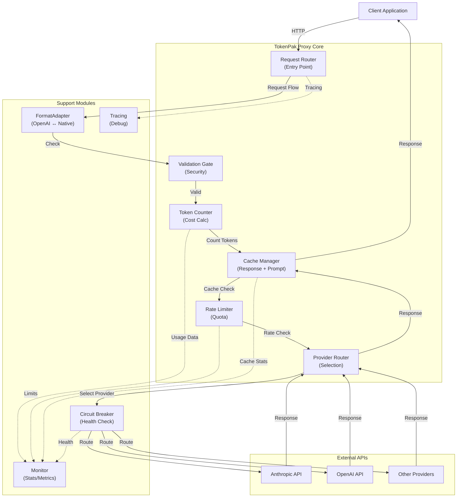

# TokenPak Component Diagram

This document describes the component diagram that visualizes TokenPak's internal module relationships.

## Simplified Component View



## Component Descriptions

### Core Request Pipeline

**1. Request Router**
- **What it does:** Receives incoming HTTP requests, validates them, extracts model name and user intent
- **Key methods:** `handle_request()`, `parse_body()`, `extract_intent()`
- **Integrates with:** FormatAdapter, Tracing

**2. FormatAdapter**
- **What it does:** Converts between OpenAI-compatible format and TokenPak's native format, so the rest of the proxy doesn't care what the client sent
- **Key methods:** `adapt_to_native()`, `adapt_from_native()`, `normalize_headers()`
- **Integrates with:** Request Router, Provider Router

**3. Validation Gate**
- **What it does:** Inspects request/response content against configured policies; detects risky, non-compliant, or suspicious messages
- **Key methods:** `check_content()`, `classify_risk()`, `apply_policy()`
- **Integrates with:** Request Router, Cache Manager

**4. Token Counter (VaultIndex)**
- **What it does:** Accurately counts tokens per provider, handles prompt cache tokens (reads cost 1/4, creation costs full), and feeds data to cost calculations
- **Key methods:** `count_tokens()`, `estimate_cache_tokens()`, `calculate_cost()`
- **Integrates with:** Monitor, Cache Manager

**5. Cache Manager**
- **What it does:** Stores and retrieves responses, supports exact-match and semantic deduplication, injects prompt cache headers
- **Key methods:** `lookup_cache()`, `store_response()`, `compute_semantic_hash()`, `inject_cache_headers()`
- **Integrates with:** Validation Gate, Token Counter, Monitor

**6. Rate Limiter**
- **What it does:** Enforces per-IP limits, per-model limits, and cost budgets; prevents abuse and runaway spending
- **Key methods:** `check_limit()`, `consume_quota()`, `is_within_budget()`
- **Integrates with:** Provider Router, Monitor

**7. Provider Router**
- **What it does:** Selects which LLM provider to use based on routing rules, provider health, and failover policy
- **Key methods:** `select_provider()`, `apply_routing_rules()`, `get_healthy_providers()`
- **Integrates with:** Circuit Breaker, Rate Limiter

### Support Modules

**8. Circuit Breaker**
- **What it does:** Monitors provider health (latency, error rates, API availability); detects when a provider is degraded and routes around it
- **Key methods:** `check_health()`, `record_failure()`, `record_success()`, `is_provider_healthy()`
- **Integrates with:** Provider Router, Monitor

**9. Monitor (Stats/Metrics)**
- **What it does:** Aggregates real-time statistics: token usage, cost, cache hit rate, latency, provider health
- **Key methods:** `record_usage()`, `record_cache_hit()`, `record_latency()`, `export_stats()`
- **Integrates with:** Token Counter, Cache Manager, Rate Limiter, Circuit Breaker

**10. Tracing (StageTrace & PipelineTrace)**
- **What it does:** Records request journey through the proxy for debugging and performance analysis; traces cache hits, provider selection, token counting
- **Key methods:** `start_trace()`, `log_stage()`, `end_trace()`
- **Integrates with:** Request Router, all core components

## Data Flow Summary

```
User Request
    ↓
[Request Router] — parses request
    ↓
[FormatAdapter] — converts format if needed
    ↓
[Validation Gate] — checks content safety
    ↓
[Cache Manager] — checks for cached response
    ├─ Hit? → Return cached response (0 tokens) → Send to user
    └─ Miss?
        ↓
        [Rate Limiter] — checks quota
        ↓
        [Provider Router] — selects provider
        ↓
        [Circuit Breaker] — verifies provider health
        ↓
        [External API] — sends request to provider
        ↓
        [Response Received]
        ↓
        [Token Counter] — counts input/output tokens
        ↓
        [Cache Manager] — stores response for future use
        ↓
        [Monitor] — records stats (cost, latency, cache, etc.)
        ↓
        Send response to user
```

## Performance Characteristics

| Component | Latency Impact | Notes |
|-----------|---|---|
| Request Router | < 1ms | Parsing only |
| FormatAdapter | < 1ms | Format conversion |
| Validation Gate | 10-50ms | Depends on content size & policy complexity |
| Cache Lookup | < 5ms | Local database query |
| Token Counter | 5-20ms | Tokenizer operation |
| Rate Limiter | < 1ms | Hash table lookup |
| Provider Router | < 1ms | In-memory logic |
| Circuit Breaker | < 1ms | In-memory health state |

**Typical end-to-end latency (cache miss):** 150-500ms (most time spent waiting for provider response)

## Testing Strategy

Each module has unit and integration tests:

```
tests/
├── test_request_router.py       — Parse & validation
├── test_format_adapter.py       — Format conversion
├── test_validation_gate.py      — Content security
├── test_token_counter.py        — Token accuracy
├── test_cache_manager.py        — Cache hit/miss logic
├── test_rate_limiter.py         — Quota enforcement
├── test_provider_router.py      — Provider selection
├── test_circuit_breaker.py      — Health checking
├── test_monitor.py              — Stats collection
└── integrations/
    ├── test_anthropic.py        — Anthropic integration
    ├── test_openai.py           — OpenAI integration
    └── test_litellm.py          — LiteLLM integration
```

## Extension Points

To add a new feature to TokenPak, typically you:

1. **Add a new module** in the appropriate layer
2. **Integrate with Monitor** to export metrics
3. **Add tests** for your module
4. **Update configuration** if new settings are needed
5. **Document** the new feature in `docs/`

See `docs/CONTRIBUTING.md` for detailed extension patterns.
