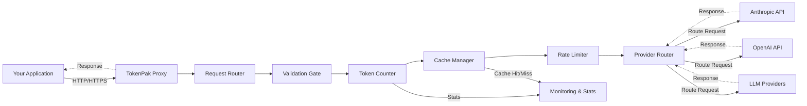
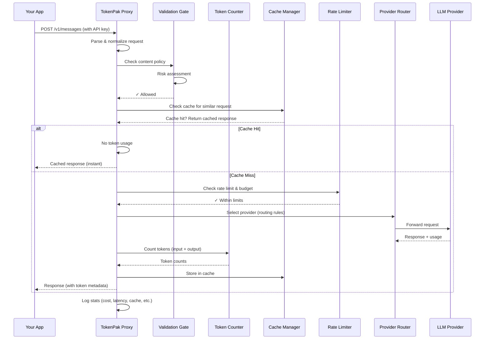
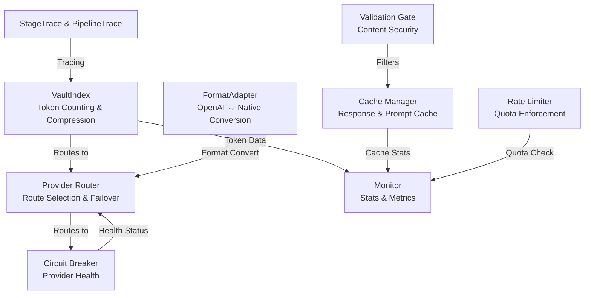

# TokenPak Architecture

TokenPak is a transparent, feature-rich proxy that sits between your LLM client application and multiple LLM providers (Anthropic, OpenAI, etc.). It handles routing, caching, token counting, cost tracking, rate limiting, and security—without requiring you to change a single line in your application code.

## High-Level Overview



## Core Components

### 1. **Request Router**
The entry point that receives all API requests from your application. It normalizes incoming requests (support for both OpenAI-compatible and native formats), extracts metadata, and passes requests through the pipeline.

**Responsibility:** Parse and validate incoming requests, extract user intent and model name, prepare request body for downstream processing.

### 2. **Validation Gate**
An optional safety layer that inspects message content against configured policies before passing to the proxy. Can detect and block suspicious patterns, enforce compliance rules, or rate-limit based on content risk.

**Responsibility:** Content security scanning, policy enforcement, risk classification of requests and responses.

### 3. **Token Counter**
Counts input and output tokens accurately using provider-specific tokenizers. Works transparently for streaming and non-streaming responses, supports prompt caching token accounting, and feeds real usage data to the cost tracker.

**Responsibility:** Accurate token counting per provider, cache-aware token calculation, real-time stats collection.

### 4. **Cache Manager**
Implements a multi-layer caching strategy: semantic deduplication (recognizes similar prompts), prompt caching integration (leverages provider caching when available), and configurable TTL-based cache eviction.

**Responsibility:** Cache storage and retrieval, cache hit rate optimization, prompt cache header management, token savings calculation.

### 5. **Rate Limiter**
Enforces per-IP rate limiting, per-model rate limits, and cost-per-minute budgets. Prevents runaway spending and protects against abuse.

**Responsibility:** Rate limit enforcement, cost-based throttling, backpressure handling.

### 6. **Provider Router**
Decides which LLM provider to use based on request metadata, fallback rules, and provider health. Supports weighted routing, circuit breakers (detects down providers), and failover logic.

**Responsibility:** Provider selection, failover logic, circuit breaker management, health checking.

### 7. **Monitoring & Observability**
Real-time stats collection: token usage, cost, cache hit rates, latency, provider health. Exports metrics to dashboards and analytics tools.

**Responsibility:** Metrics collection, stats aggregation, performance monitoring, usage reporting.

---

## Request Flow

Here's what happens when your application sends a request through TokenPak:



1. **Parse Request** — Normalize the incoming request format (OpenAI-compatible, native, etc.)
2. **Validation** — Check content against policies; block if unsafe
3. **Cache Check** — Look for cached response (exact or semantic match)
4. **Rate Limit Check** — Verify IP is within quota; verify cost budget
5. **Provider Selection** — Pick the best provider based on routing rules and health
6. **Forward Request** — Send to the chosen LLM provider
7. **Count Tokens** — Calculate input and output token usage
8. **Update Cache** — Store response for future use
9. **Collect Stats** — Record cost, latency, cache hit, usage metrics
10. **Return Response** — Send response back to application

---

## Deployment Models

### Single-Machine Deployment
TokenPak runs on one machine and all requests flow through it. Simple, low-overhead setup.

```
Your Application → [TokenPak Proxy] → LLM Provider
                        ↓
                   Local SQLite Cache
                   Local Stats DB
```

### Docker Deployment
Run TokenPak in a containerized environment, easily scalable.

```
Docker Container
├── TokenPak Proxy
├── Cache (volume mount)
└── Stats (volume mount)
```

### Multi-Node Deployment (Distributed)
Multiple TokenPak instances for high availability and load distribution.

```
Load Balancer
    ↓
  ┌─────────────┬─────────────┬─────────────┐
  ↓             ↓             ↓
Node 1       Node 2       Node 3
[TokenPak]   [TokenPak]   [TokenPak]
  ↓             ↓             ↓
[Shared Cache] ← Redis/Memcached or similar
[Shared Stats] ← Prometheus/InfluxDB or similar
```

---

## Internal Module Structure



- **StageTrace & PipelineTrace:** Request tracing for debugging and performance analysis
- **VaultIndex:** Token counting, semantic compression, and cost calculation
- **Provider Router:** Logic for selecting which LLM provider to use
- **Validation Gate:** Content scanning and policy enforcement
- **Cache Manager:** Response caching and prompt cache integration
- **Rate Limiter:** Per-IP, per-model, and cost-based limits
- **Monitor:** Real-time stats and usage reporting
- **FormatAdapter:** Converts between OpenAI and native formats transparently
- **Circuit Breaker:** Detects and routes around failing providers

---

## Caching Strategy

TokenPak uses a three-tier caching approach to maximize token savings:

1. **Exact Match Cache** — If we've seen this exact request before, return the cached response instantly (0 tokens)
2. **Semantic Cache** — If a similar request exists (same intent, minor wording differences), TokenPak can return a cached response with high confidence
3. **Prompt Cache Headers** — When available, TokenPak automatically injects prompt caching headers so the LLM provider caches expensive prompt prefixes

---

## Token Counting & Cost Tracking

TokenPak counts tokens accurately for every request/response, accounting for:

- **Input tokens** — User message + system prompt
- **Output tokens** — Model response
- **Cache read tokens** — Tokens served from provider caching (1/4 cost)
- **Cache creation tokens** — Tokens used to create a new cache entry (full cost)

Cost is calculated per-provider using live pricing data, giving you real per-request cost visibility.

---

## Monitoring & Observability

TokenPak exports metrics for:

- **Token usage** — Input, output, cache reads, cache creates
- **Cost** — Per-request, per-model, cumulative
- **Cache metrics** — Hit rate, miss rate, semantic matches
- **Provider health** — Response times, error rates, circuit breaker status
- **Rate limiting** — Requests throttled, budgets exceeded
- **Latency** — End-to-end response time, provider latency

Access stats via:

```bash
curl http://localhost:8766/stats
```

---

## Security Features

- **Validation Gate:** Blocks suspicious content before it reaches providers
- **Rate Limiting:** Prevents abuse and runaway costs
- **Per-IP Quotas:** Control who can use the proxy and how much
- **API Key Isolation:** Proxied requests don't leak your API keys to the client
- **Encrypted Config:** Sensitive settings encrypted at rest

---

## Configuration

TokenPak is configured via environment variables and a local config file:

```env
# Core settings
TOKENPAK_BIND=0.0.0.0:8766
TOKENPAK_UPSTREAM=https://api.anthropic.com

# Cache settings
CACHE_ENABLED=true
CACHE_TTL_SECONDS=3600

# Rate limiting
RATE_LIMIT_PER_IP=100  # requests per minute
COST_LIMIT_PER_MINUTE=10.0  # dollars per minute

# Validation gate
VALIDATION_GATE_ENABLED=true
```

See `docs/CONFIG.md` for full options.

---

## Extension Points

TokenPak is designed to be extended:

- **Custom providers** — Add support for new LLM APIs
- **Custom validation rules** — Implement your own content policies
- **Custom cache backends** — Use Redis, Memcached, or your own storage
- **Custom routing logic** — Implement custom provider selection rules
- **Custom metrics exporters** — Send stats to your monitoring system

See `docs/CONTRIBUTING.md` for extension patterns.
